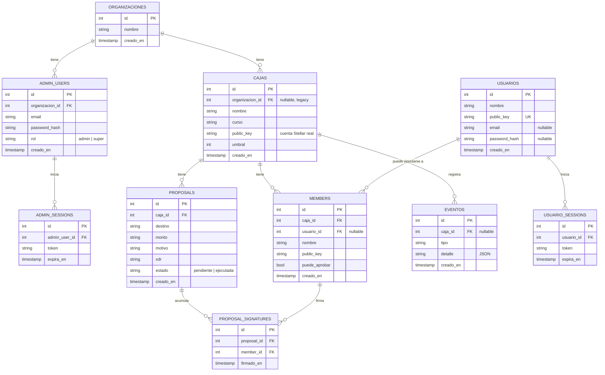

# stellar-demo
stellar hackaton 30 septiembre 2026

## Modelo de datos

Stellar sigue siendo la fuente de verdad del dinero — estas tablas solo dan contexto legible (nombres, motivos, quién puede aprobar, historial) que la cadena no guarda. El esquema completo vive en `backend/schema.sql` (Postgres), `backend/schema.mysql.sql` y `backend/schema.sqlite.sql`.

`codigos_recuperacion` (tipo, email, codigo, expira_en, usado) no está en el diagrama porque no se relaciona por FK con nada — es una tabla de soporte para el flujo de recuperación de contraseña.

**Grupos, por responsabilidad:**
- **Multi-tenant / administración:** `organizaciones`, `admin_users`, `admin_sessions` — quién puede crear cajas y para qué organización.
- **Núcleo de la Caja (lo que ya se probó end-to-end en Stellar):** `cajas`, `members`, `proposals`, `proposal_signatures`.
- **Usuarios finales:** `usuarios`, `usuario_sessions` — login opcional para que una persona vea "mis cajas" sin ser admin.
- **Soporte:** `eventos` (trazabilidad/auditoría), `codigos_recuperacion` (recuperar contraseña).

POST /faucet
Request:

{ "destination": "GABC...56chars" }
Response (200):

{ "ok": true, "hash": "abc123..." }
Errores: 400 missing_destination, 400 invalid_destination, 500 issuer_not_configured, 422 horizon_rejected (con result_codes.transaction y result_codes.operations)

POST /cajas
Requiere login de administrador: header `Authorization: Bearer <token>` (el token sale de POST /auth/login). La caja queda asociada a la organizacion del admin (campo organizacion_id en la respuesta de GET /cajas/{id}).
Request:

{ "nombre": "Caja 4to Medio B", "curso": "4to Medio B", "public_key": "GBTC...", "umbral": 2 }
Response (201):

{ "ok": true, "id": 1 }
Errores: 400 missing_fields, 401 unauthorized

GET /cajas/{id}
Response (200):

{
  "ok": true,
  "caja": {
    "id": 1,
    "nombre": "Caja 4to Medio B",
    "curso": "4to Medio B",
    "public_key": "GBTC...",
    "umbral": 2,
    "creado_en": "2026-09-22 13:23:51",
    "members": [
      { "id": 1, "nombre": "Josue Valenzuela", "public_key": "GB2K...", "puede_aprobar": true, "usuario_id": 3 },
      { "id": 2, "nombre": "Ana", "public_key": "GANA...", "puede_aprobar": false, "usuario_id": null }
    ]
  }
}
Error: 404 caja_not_found

GET /cajas/{id}/estado
Consulta en vivo a Stellar (Horizon) — balance real y ultimas transacciones de la cuenta de la caja. No usa la base de datos para esto (solo lee cajas.public_key).
Response (200):

{
  "ok": true,
  "public_key": "GBTC...",
  "balances": [
    { "asset": "XLM", "balance": "9999.9998900" }
  ],
  "transacciones": [
    { "tipo": "payment", "creado_en": "2026-09-25T13:43:52Z", "transaction_hash": "9952434a..." }
  ]
}
Error: 404 caja_not_found, 404 account_not_found_on_stellar (la caja existe en la BD pero su public_key todavia no tiene cuenta creada/fondeada en Stellar)

POST /cajas/{id}/members
Dos modos. Con claves sueltas (flujo original):

{ "nombre": "Tomas B.", "public_key": "GASV..." }
O vinculado a un usuario registrado (usa su nombre y public_key, y guarda el vinculo en usuario_id):

{ "usuario_id": 3 }
Response (201):

{ "ok": true, "id": 2, "puede_aprobar": true }
Errores: 400 missing_fields, 404 usuario_not_found (modo usuario_id), 409 miembro_duplicado (modo usuario_id: la public_key del usuario ya es miembro de la caja)
POST /cajas/{id}/proposals
Request:

{ "destino": "GDN4...", "monto": "20", "motivo": "Arriendo de cancha", "xdr": "AAAAAgAAAAA..." }
Response (201):

{ "ok": true, "id": 1 }
GET /cajas/{id}/proposals
Response (200):

{
  "ok": true,
  "proposals": [
    {
      "id": 1,
      "caja_id": 1,
      "destino": "GDN4...",
      "monto": "20",
      "motivo": "Arriendo de cancha",
      "xdr": "AAAAAgAAAAA...",
      "estado": "pendiente",
      "creado_en": "2026-09-22 13:23:51",
      "signatures": [
        { "member_id": 1, "firmado_en": "2026-09-22 13:23:51" }
      ]
    }
  ]
}
POST /proposals/{id}/signatures
La firma solo se acepta si member_id es miembro de la caja de la propuesta y tiene la aprobacion encendida (puede_aprobar). Las firmas ya emitidas siguen contando aunque despues se apague la aprobacion del miembro: apagar solo bloquea NUEVAS firmas.
Request:

{ "member_id": 2, "xdr": "AAAAAgAAAAA...FIRMADO" }
Response (201):

{ "ok": true }
Errores: 400 missing_fields, 404 proposal_not_found, 404 member_not_found, 403 aprobacion_desactivada

POST /proposals/{id}/ejecutar
Cuando ya se juntaron las firmas necesarias (segun umbral de la caja), toma el XDR final guardado y lo envia de verdad a Stellar. Marca la propuesta como "ejecutada".
Response (200):

{ "ok": true, "hash": "6c14d4bf..." }
Errores: 404 proposal_not_found, 404 caja_not_found, 409 proposal_already_executed, 409 not_enough_signatures (incluye firmas y umbral), 422 horizon_rejected (con result_codes)

PUT /cajas/{id}
Requiere Bearer token de un admin de la organizacion de la caja (o de cualquier admin si la caja no tiene organizacion, legacy).
Request:

{ "nombre": "Caja 4to Medio B (renombrada)" }
Response (200):

{ "ok": true }
Errores: 400 missing_fields, 401 unauthorized, 403 forbidden, 404 caja_not_found

DELETE /cajas/{id}
Misma regla de auth que PUT /cajas/{id}. Borra primero las firmas de sus propuestas, las propuestas, los miembros y los eventos de la caja, y despues la caja.
Response (200):

{ "ok": true }
Errores: 401 unauthorized, 403 forbidden, 404 caja_not_found

PUT /cajas/{id}/members/{memberId}
Misma regla de auth que PUT /cajas/{id}. Acepta nombre, puede_aprobar, o ambos (al menos uno requerido).
Request:

{ "nombre": "Tomas B." }
{ "puede_aprobar": false }
Response (200):

{ "ok": true }
Errores: 400 missing_fields, 401 unauthorized, 403 forbidden, 404 caja_not_found, 404 member_not_found

DELETE /cajas/{id}/members/{memberId}
Misma regla de auth que PUT /cajas/{id}.
Response (200):

{ "ok": true }
Errores: 401 unauthorized, 403 forbidden, 404 caja_not_found, 404 member_not_found

POST /usuarios
Registra una persona (nombre + clave publica, email y password opcionales para login). Si la clave ya existe, devuelve el mismo id con ya_existia: true.
Request:

{ "nombre": "Tomas B.", "public_key": "GASV...", "email": "tomas@x.cl", "password": "clave123" }
Response (201):

{ "ok": true, "id": 1 }
Errores: 400 missing_fields, 409 email_duplicado

GET /usuarios
Requiere Bearer token de admin (cualquier organizacion).
Response (200):

{ "ok": true, "usuarios": [ { "id": 1, "nombre": "Tomas B.", "public_key": "GASV...", "email": "tomas@x.cl", "creado_en": "2026-09-28 20:00:00" } ] }
Error: 401 unauthorized

PUT /usuarios/{id}
Requiere Bearer token de admin.
Request:

{ "nombre": "Tomas B. (editado)" }
Response (200):

{ "ok": true }
Errores: 400 missing_fields, 401 unauthorized, 404 usuario_not_found

DELETE /usuarios/{id}
Requiere Bearer token de admin. Borra tambien sus sesiones.
Response (200):

{ "ok": true }
Errores: 401 unauthorized, 404 usuario_not_found

POST /auth/usuario/login
Login de usuario (abierto, sin admin). El token se usa como `Authorization: Bearer <token>` en GET /usuarios/me/cajas. Dura 7 dias.
Request:

{ "email": "tomas@x.cl", "password": "clave123" }
Response (200):

{ "ok": true, "token": "1507cc...", "usuario": { "id": 1, "nombre": "Tomas B.", "public_key": "GASV...", "email": "tomas@x.cl" } }
Errores: 400 missing_fields, 401 credenciales_invalidas

GET /usuarios/me/cajas
Requiere Bearer token de USUARIO (el de POST /auth/usuario/login, no el de admin). Devuelve las cajas donde el usuario es miembro (match por public_key en members).
Response (200):

{ "ok": true, "cajas": [ { "id": 1, "organizacion_id": 1, "nombre": "Caja 4B", "curso": "4B", "public_key": "GBTC...", "umbral": 2, "creado_en": "..." } ] }
Error: 401 unauthorized

GET /usuarios/{public_key}
Response (200):

{ "ok": true, "usuario": { "id": 1, "nombre": "Tomas B.", "public_key": "GASV...", "creado_en": "2026-09-28 20:00:00" } }
Error: 404 usuario_not_found

GET /cajas/{id}/trazabilidad
Historial de acciones de la caja (caja creada, miembro agregado, propuesta creada/firmada/ejecutada, faucet). detalle viene como objeto JSON ya decodificado.
Response (200):

{
  "ok": true,
  "eventos": [
    {
      "id": 3,
      "caja_id": 1,
      "tipo": "propuesta_firmada",
      "detalle": { "proposal_id": "1", "member_id": 2 },
      "creado_en": "2026-09-28 20:05:00"
    },
    {
      "id": 2,
      "caja_id": 1,
      "tipo": "propuesta_creada",
      "detalle": { "proposal_id": "1", "destino": "GDN4...", "monto": "20", "motivo": "Arriendo" },
      "creado_en": "2026-09-28 20:00:00"
    }
  ]
}
Error: 404 caja_not_found

Tipos de evento: caja_creada, caja_editada, caja_eliminada, miembro_agregado, miembro_editado, miembro_eliminado, miembro_aprobacion_on, miembro_aprobacion_off, propuesta_creada, propuesta_firmada, propuesta_ejecutada, faucet_pedido, usuario_creado, usuario_editado, usuario_eliminado, usuario_login, organizacion_creada, organizacion_editada, organizacion_eliminada, admin_creado, admin_editado, admin_eliminado, admin_login (los que no son de una caja van con caja_id null).

POST /auth/login
Request:

{ "email": "admin@curso.cl", "password": "secreto123" }
Response (200):

{ "ok": true, "token": "97f0dbe9...", "email": "admin@curso.cl", "organizacion_id": 1 }
Errores: 400 missing_fields, 401 credenciales_invalidas
El token se manda en las rutas protegidas como `Authorization: Bearer <token>`. Dura 7 dias.

## Privilegios

Dos roles en `admin_users.rol`: `admin` (solo su organizacion) y `super` (ve y crea organizaciones, gestiona cualquier admin, asigna/quita el rol super). El primer super se siembra desde `SUPER_ADMIN_EMAIL` + `SUPER_ADMIN_PASSWORD` (org "Cosigna"); no se puede quitar el ultimo super (`409 ultimo_super`). POST /auth/login devuelve `rol`.

POST /organizaciones
Crea la organizacion y su primer admin de una vez. Requiere Bearer token de un super-admin.
Request:

{ "nombre": "Curso 4to Medio B", "email": "admin@curso.cl", "password": "secreto123" }
Response (201):

{ "ok": true, "id": 1, "admin_id": 1 }
Errores: 400 missing_fields, 401 unauthorized, 403 forbidden, 409 email_ya_registrado

GET /organizaciones
Lista todas las organizaciones con conteo de admins y cajas. Requiere Bearer token de un super-admin.
Response (200):

{ "ok": true, "organizaciones": [ { "id": 1, "nombre": "Cosigna", "creado_en": "...", "admins": 1, "cajas": 0 } ] }
Errores: 401 unauthorized, 403 forbidden

POST /organizaciones/{id}/admins
Agrega un admin a la organizacion. Requiere Bearer token de un admin DE ESA organizacion.
Request:

{ "email": "segundo@curso.cl", "password": "otro12345" }
Response (201):

{ "ok": true, "id": 2 }
Errores: 400 missing_fields, 401 unauthorized, 403 forbidden (token de otra organizacion), 409 email_ya_registrado

GET /organizaciones/{id}/admins
Requiere Bearer token de un admin de esa organizacion.
Response (200):

{ "ok": true, "admins": [ { "id": 1, "organizacion_id": 1, "email": "admin@curso.cl", "creado_en": "2026-09-28 20:49:32" } ] }
Errores: 401 unauthorized, 403 forbidden

PUT /organizaciones/{id}/admins/{adminId}
Cambia el password de un admin (admin de esa org o super) y/o su rol (solo super: `admin` | `super`; no se puede bajar al ultimo super).
Request:

{ "password": "nueva12345", "rol": "super" }
Response (200):

{ "ok": true }
Errores: 400 missing_fields, 400 rol_invalido, 401 unauthorized, 403 forbidden, 404 admin_not_found, 409 ultimo_super

DELETE /organizaciones/{id}/admins/{adminId}
Requiere Bearer token de un admin de esa organizacion. No deja a la organizacion sin admins.
Response (200):

{ "ok": true }
Errores: 401 unauthorized, 403 forbidden, 404 admin_not_found, 409 ultimo_admin

GET /organizaciones/{id}/cajas
Requiere Bearer token de un admin de esa organizacion.
Response (200):

{ "ok": true, "cajas": [ { "id": 1, "organizacion_id": 1, "nombre": "Caja 4B", "curso": "4B", "public_key": "GBTC...", "umbral": 2, "creado_en": "..." } ] }
Errores: 401 unauthorized, 403 forbidden

PUT /organizaciones/{id}
Requiere Bearer token de un admin de esa organizacion.
Request:

{ "nombre": "Curso 4to Medio B (renombrado)" }
Response (200):

{ "ok": true }
Errores: 400 missing_fields, 401 unauthorized, 403 forbidden

DELETE /organizaciones/{id}
Requiere Bearer token de un admin de esa organizacion. Solo borra si la organizacion no tiene cajas; si tiene, responde 409. Al borrar elimina las sesiones y los admins de la org.
Response (200):

{ "ok": true }
Errores: 401 unauthorized, 403 forbidden, 409 organizacion_tiene_cajas

POST /auth/recuperar
Pide un codigo de 6 digitos para cambiar la clave (sirve para usuarios y admins). Si el correo existe se le envia el codigo por email (vence en 15 min). Siempre responde ok para no revelar si el correo existe.
Request:
{ "email": "tomas@x.cl" }
Response (200):
{ "ok": true }

POST /auth/cambiar-clave
Cambia la clave usando el codigo recibido. Cierra todas las sesiones de esa cuenta (hay que entrar de nuevo).
Request:
{ "email": "tomas@x.cl", "codigo": "123456", "password": "nueva" }
Response (200):
{ "ok": true }
Errores: 400 missing_fields, 400 codigo_invalido

## Correos transaccionales

Con `RESEND_API_KEY` configurada el backend envia (de marca, nunca rompen el request si fallan):
- Bienvenida al registrarse un usuario con email (POST /usuarios).
- Aviso "gasto aprobado" cuando una propuesta se ejecuta — a los miembros con usuario registrado que tengan email y a los admins de la organizacion.
- Codigo de recuperacion de clave (POST /auth/recuperar).
Sin la clave los correos se omiten en silencio. `CORREO_DESDE` define el remitente.

Que requiere login y que no:
- CON login de admin (Bearer token de POST /auth/login): POST /cajas, PUT /cajas/{id}, DELETE /cajas/{id}, PUT /cajas/{id}/members/{memberId}, DELETE /cajas/{id}/members/{memberId}, GET /usuarios, PUT /usuarios/{id}, DELETE /usuarios/{id}, POST /organizaciones/{id}/admins, GET /organizaciones/{id}/admins, PUT /organizaciones/{id}/admins/{adminId}, DELETE /organizaciones/{id}/admins/{adminId}, GET /organizaciones/{id}/cajas, PUT /organizaciones/{id}, DELETE /organizaciones/{id}.
- SOLO super-admin: POST /organizaciones, GET /organizaciones, cambiar rol en PUT admins.
- CON login de usuario (Bearer token de POST /auth/usuario/login): GET /usuarios/me/cajas.
- SIN login (no rompe el flujo del miembro que aprueba gastos): GET /cajas/{id}, GET /cajas/{id}/estado, GET /cajas/{id}/proposals, GET /cajas/{id}/trazabilidad, POST /cajas/{id}/members, POST /cajas/{id}/proposals, POST /proposals/{id}/signatures, POST /proposals/{id}/ejecutar, POST /faucet, POST /usuarios, GET /usuarios/{public_key}, POST /auth/login, POST /auth/usuario/login, POST /auth/recuperar, POST /auth/cambiar-clave.
